# README.md

## Assignment: Part I - Linux, Setup

   1. Create a directory named "cli_assignment":
             
   2. Change the current working directory to the new directory created in the previous step:
      
   3. Create a new file named "stuff.txt" using the touch command:
       
   4. Add some text (multiple lines) to this text file using the cat command:
       
   5. Count the number of words and lines in the file "stuff.txt":
      
   6. Append more text to the file "stuff.txt":
      
      
   7. Create a new directory "draft":
      8. Move the "stuff.txt" file to the directory "draft":
      
      
   9. Change your working directory to "draft" and create a hidden file named "secret.txt":
      
   10. 10 Create a new directory ("final") as a copy of the "draft" directory:
       
       
   11.  Rename the "draft" directory to "draft.remove":
        
   12. Move the "draft.remove" directory inside the "final" directory:
         
   13. List all the files and sub-directories in "cli_assignment" and their permissions:
        
        
   14. List the contents of the given file "NASA_access_log_Aug95.gz" without extracting it:
       
        
   15.  Extract the given file "NASA_access_log_Aug95.gz":
       
   16. Rename the extracted file to "logs.txt":
        
   17. Move the file "logs.txt" to the "cli_assignment" directory:
        > Already in cli_assignment
        
   18. Read the top 100 lines of the file "logs.txt":
        
   19. Create a new file "logs_top_100.txt" containing the top 100 lines using I/O redirection:
         
   20. Create a new file "logs_bottom_100.txt" containing the bottom 100 lines using I/O redirection:
          
   21. Create a new file "logs_snapshot.txt" by concatenating "logs_top_100.txt" and "logs_bottom_100.txt":
          
   22. Append "asurite: This is a great assignment" and the current date to "logs_snapshot.txt":
          
   23. Read the file "logs.txt" using the less command:
          
   24. Print the column "student_names" from "marks.csv" without the header:
          
          
          
   25. Print the sorted list of marks in "subject_3":
           
   26. Print the average marks for "subject_2":
           
   27. Save the average into a new file "done.txt":
            
   28. Move "done.txt" into your "final" directory":
            
   29. Rename the "done.txt" file to "average.txt":
        


### Video URL
*Provide the URL to your screencast here.*
URL :  https://youtu.be/TCTh6g-HU-Q
---

### GitHub Repository Link
*Provide the link to your GitHub repository here.*
Fork : https://github.com/Bjablaso/ser321examples_bjablaso_fork
MyGitHub Link : https://github.com/Bjablaso/ser321-spring25-A-Bjablaso

---

## Prerequisites
1. Familiarize yourself with the command line in Unix.
2. Review the information on Canvas.

### Learning Outcomes
- Efficient use of the command line.
- Comfort with command line pipelining and I/O redirection.

---

## Command Line Tasks (17 points)

**System Used:** 
*Specify your system here (e.g., Linux, Windows WSL, etc.).*
 > i use my MacOs terminal for more task 
 > i use  linux Kali for some task
 

---

## Setup and Examples (30 points)

### 2.1. GitHub Repository Setup (5 points)
1. What is the name of the repository?
   > ser321-spring25-A-Bjablaso
2. Did you add the `ser316asu` collaborator? 
    > Yes
3. What did you do to ensure empty folders were added?
    > I added blank .gitkeep file 

**Subfolders:**
- Assignment1
- Assignment2
- Assignment3
- Assignment4
- Assignment5
- Assignment6

### GitHub Repository Link
*Provide the link to your GitHub repository here.*
    >   MyGitHub Link : https://github.com/Bjablaso/ser321-spring25-A-Bjablaso
   


### 2.2. Running Examples (10 points)
**Examples Chosen:**
1. Example 1: What is the name of the example? 
 > Example name : JavaSimpleSock
   - **Screenshot:** Provide a screenshot showing the example execution.
    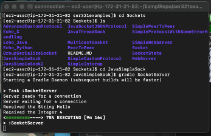
   - 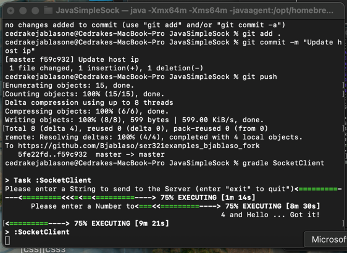
   - 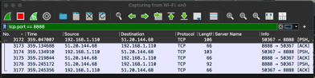
   - **Explanation:** Briefly explain what this example does.
 > In this Example we use AWS to host a server in which we connected to throgh our local client. 
 >  We use our client to send a message to the server in a form of a string.
 > Server remain open until client disconnect or is no longer available.

2. Example 2: What is the name of the example?
    > Example name : JavaSimpleSock2
   - **Screenshot:** Provide a screenshot showing the example execution.
     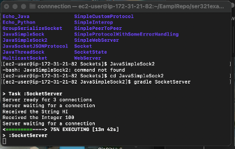
   - 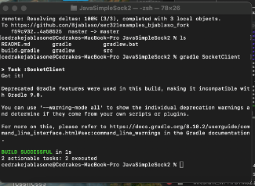
   - 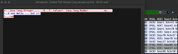
 
   - **Explanation:** Briefly explain what this example does.

3. Example 3: What is the name of the example?
   - **Screenshot:** Provide a screenshot showing the example execution.
   - **Explanation:** Briefly explain what this example does.

---

### 2.3. Understanding Gradle (7.5 points)
- What changes did you make to the `build.gradle` file and Java files?
    > The changes introduced a new Gradle task, runFrac, to execute the Fraction program with customizable numerator 
    and denominator arguments. The task uses Gradle properties (-Pnum and -Pdenom) to pass these values, defaulting 
    both to 1 if not provided. It includes validation to ensure the denominator is not zero, throwing an exception if 
     violated. Additionally, it specifies the mainClass as Fraction and configures the classpath using the 
    sourceSets.main.runtimeClasspath.

- **Deliverables:** Copy the Java Gradle folder into your GitHub Assignment1 directory.
    > Done
---

### 2.4. Setting Up the Second System (7.5 points)
1. What system did you set up (AWS, Docker, etc.)?
    > AWS
2. What steps did you take to install JDK, Gradle, and Git?
    > I followed the instructions in the video. I created an AWS account, set up the virtual computer, connected to the
      virtual computer through my local computer, and downloaded Java JDK, Gradle, and Git using the provided commands.
3. Did you run the JavaSimpleSock2 example as described in the video?
    > Yes, I ran the JavaSimpleSock2 example as described in a video

- **Screencast Link:** Provide your screencast link here.
URL :  https://youtu.be/TCTh6g-HU-Q

---

## Part II: Networking (43 points)

### 3.1. Understanding TCP Network Sockets (11 points)
1. What script/command did you use to monitor network activity?
    > In order to monitor the network activity, I use a batch script that executed the Nesta command.
    I apply some filter to capture socket connection mainly focusing on LISTEN AND Establish state for interval 
      of every 30 seconds.
   [ netstat -ant | grep -E "LISTEN|ESTABLISHED" ]

2. What data did you collect?
    > The data that I collected shows the number of active TCP socket connection in Two states the
     LISTEN AND the ESTABLISH states. Within each point, we included timestamp that shows when the data was captured,
     The socket state and Other relevant detail
3. How did you import this data into a graphing tool?
    > i wrote anotehr cript to take the text data and convert it to a CSV file and from there 
      I imported it in to excel  and turn it in to a line chart


- **Command/Script Used:**
```bash
# Add your script here (monitor_netstat.sh)
output_file="netstat_output.txt"


>$output_file

# Loop for 10 minutes 
for i in {1..20}
do
 # Print timestamp
    echo "Timestamp: $(date)" >> $output_file
    
    # Grab socket states (LISTEN and ESTABLISHED)
    netstat -ant | grep -E "LISTEN|ESTABLISHED" >> $output_file
    
    # Wait for 30 
    sleep 30
done

echo "Network monitoring complete. Results saved to $output_file."

# Add your script here (organize_netstat.sh)
#!/bin/bash

# Input and output file names
input_file="netstat_output.txt"
output_file="netstat_data.csv"

# Initialize the CSV output file with headers
echo "Timestamp,LISTEN,ESTABLISHED" > $output_file

# Initialize variables
timestamp=""
listen_count=0
established_count=0

# Process the input file line by line
while read -r line; do
    # Check if the line contains a timestamp
    if [[ $line == Timestamp:* ]]; then
        # If there was a previous timestamp, write its counts to the output
        if [[ -n $timestamp ]]; then
            echo "$timestamp,$listen_count,$established_count" >> $output_file
        fi
        
        # Extract the new timestamp
        timestamp=$(echo "$line" | sed 's/Timestamp: //')
        
        # Reset counters
        listen_count=0
        established_count=0
    elif [[ $line == *LISTEN* ]]; then
        # Increment the LISTEN count
        listen_count=$((listen_count + 1))
    elif [[ $line == *ESTABLISHED* ]]; then
        # Increment the ESTABLISHED count
        established_count=$((established_count + 1))
    fi
done < "$input_file"

# Write the last block of data if present
if [[ -n $timestamp ]]; then
    echo "$timestamp,$listen_count,$established_count" >> $output_file
fi

echo "Data successfully organized into $output_file"
```

- **Socket States Graph:** Provide a screenshot or graph.
  
---

### 3.2. Sniffing TCP/UDP Traffic (15 points)

#### TCP
1. **Wireshark Screenshot:**  
   Provide a screenshot of the Wireshark capture with appropriate filters.
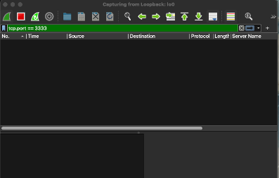
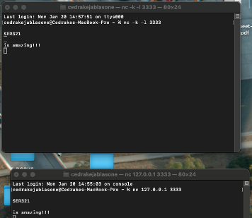
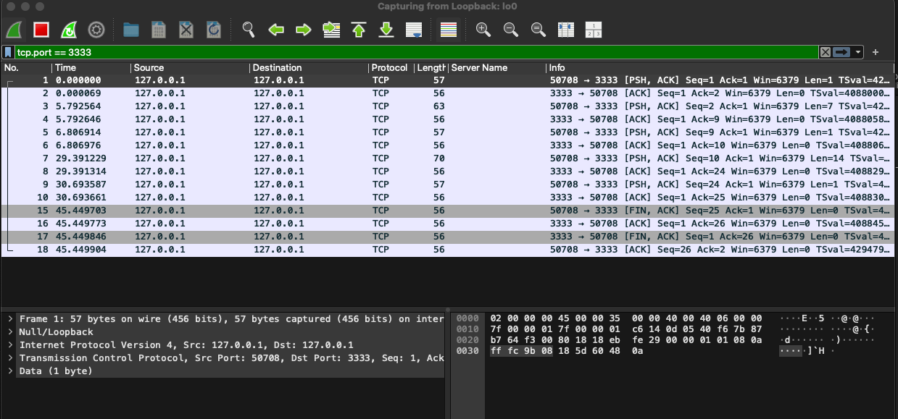
2. 
3. **Questions:**

a. Explain the commands used in detail. What did they do?
> Command : nc -k -l 3333 -> This command start a server that listens for incoming TCP connection
    on port 3333. k is a flag keep the server running after client disconnect.
> Command : nc -k -l 3333 -> This command start a server that listens for incoming TCP connection on port 3333.
    k is a flag keep the server running after client disconnect.

b. How many packets were sent back and forth for sending/receiving the two lines?
>Total for two lines: 4 packets.
    1 from the client to the server representing the data
    And 1 acknowledgement from the server

c. How many packets were used for the entire process?
> 11 total packets, 3 from handshake, 4 from data transfer 4 for TCP Connection termination.

d. How many bytes of actual data were sent from client to server?
24 byte in total byte I sent ( 21 from messages including 19 character and 3 blank space) and 3 for handshake. 
> 21 byte of actual data was sent

e. How many total bytes went over the wire?
> 24 bytes

f. How much overhead was involved compared to the actual data sent?
> i had 2 packages sent of data one 63 and another 70 totaling in 133, and I had 24 byte sent over in total.
that leave me with 133 -24 = 109 byte of over head
>109 overhead 

#### UDP
1. **Wireshark Screenshot:**  
   Provide a screenshot of the Wireshark capture with appropriate filters.
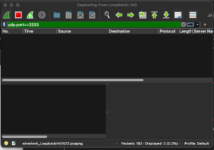
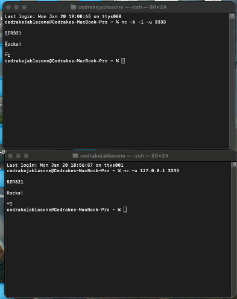
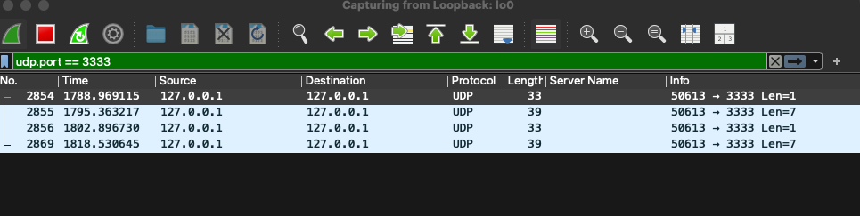
2. **Questions:**
a. Explain the commands used in detail. What did they do?
> Command : nc -k -l -u 3333 -> Start the UDP server and list on port 3333. -k is a 
flag keep the server running after client disconnect.

> Command : nc -u 127.0.0.1 3333 -> start the UDP client that send packet to the server on 127.0.01 on port 3333.

b. How many packets were used for sending the two lines?
> 2 packets were needed:

c. How many packets were used for the entire process?
> Since UDP is connectionless, only 2 packets are required for the process (one for each line sent).

d. How many bytes of actual data were sent?
> Total = 7 + 7 = 14 bytes.

e. How many total bytes went over the wire?
> 16 bytes

f. What was the overhead compared to the actual data sent?
> 70 bytes (total) - 14 bytes (data) = 56 bytes overhead.
> Overhead = (56 / 70) × 100 ≈ 80% overhead.

g. What is the difference in relative overhead between UDP and TCP, and why?
> UPD only have overhead for IP header and UDP header while TCP header plus additional packages for connection setup 
 and termination (e.g SYN, ACK, FIN). TCP ensure package reliability my making sure acknowledgement requirements are 
 met and let you know if they are not met. UDP is connectionless, so it does not exchange the handshake.

---

### 3.3. Running Client Servers in Different Ways (17 points)

#### 3.3.1. Running Locally (6 points)
- **Screencast Link:** Provide your screencast link here.
- **Questions:** What commands did you run, and what output did you get?

#### 3.3.2. Server on AWS (5 points)
- What changes were required to run the server on AWS and the client locally?
- How did you configure Wireshark for this setup?

#### 3.3.3. Client on AWS (3 points)
- Can you run the server locally and the client on AWS? Why or why not?
   > Running the client on AWS and the server locally may not work because the local server
   >  will be running on a private IP address, which is only known to the router and is not 
   > accessible by external networks. 
- What is different in this setup compared to others?
   > The difference between these steps compared to others is that running a server locally means the server 
   > will be on a private network. This means that, in order to connect to the server, we will need to expose our
   >  private network to the outside world.

#### 3.3.4. Client on AWS 2 (3 points)
- Why can you easily connect to your AWS server from your local client, but not vice versa?
   > It's easy to connect a local client to an AWS server because AWS is on a public network and 
   > can be accessed from anywhere. However, if the roles were reversed, it would be challenging
   > to access a server on a local network without encountering issues.

- What changes are necessary to connect to a local server from the outside world?
   > To answer this question, it’s important to understand how networks function. Local IPs, 
   > such as 192.168.x.x or 10.x.x.x, are private addresses used within a local network and 
   > are only known to the router managing that network. The router itself is assigned a public 
   >IP address by the Internet Service Provider (ISP), which makes it accessible over the internet. 
   > When attempting to run a client on AWS and a server locally, an issue arises because the client
   > on AWS cannot directly reach the local server. This is because the local server's private 
   > IP address is not routable outside the local network due to the router's Network Address Translation (NAT). 
   > To allow external access, requests must be routed through the router, which would require configuration such
   > as port forwarding to ensure the traffic reaches the correct local server. However, this introduces security 
   > risks by exposing the local network to potential external threats, making it a less-than-optimal solution.
   > This highlights the inherent challenges in making a local server accessible to external clients while maintaining security.
---

## Additional Information
- Ensure all links and screenshots are accessible.
- Replace placeholder text with actual details before submission.
- Maintain proper formatting and clean up any unnecessary content.
