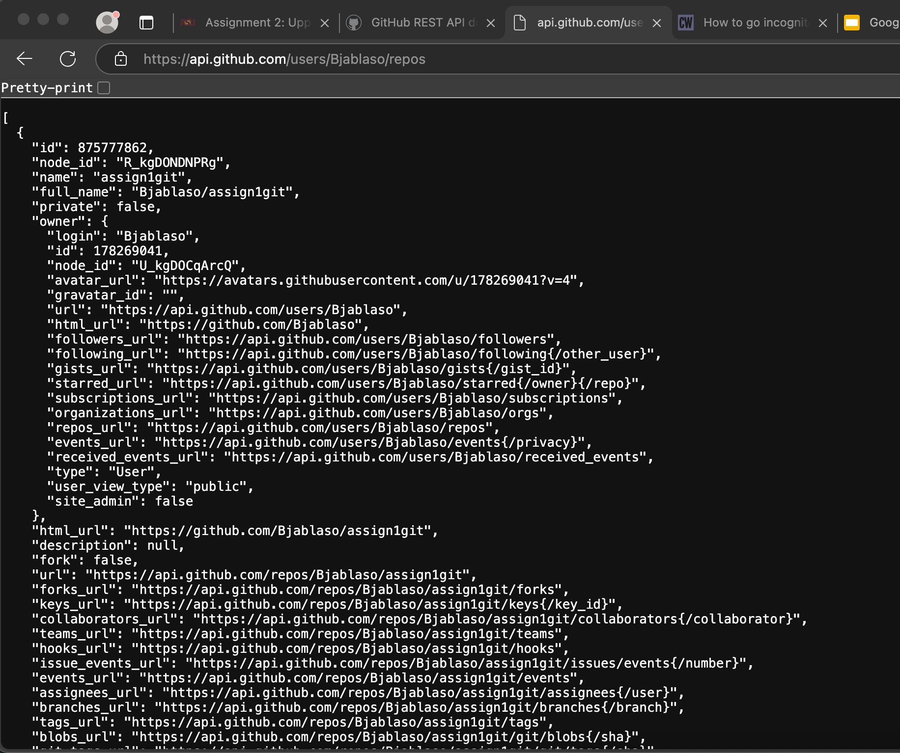
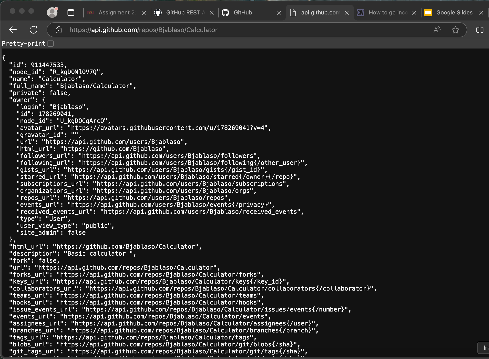
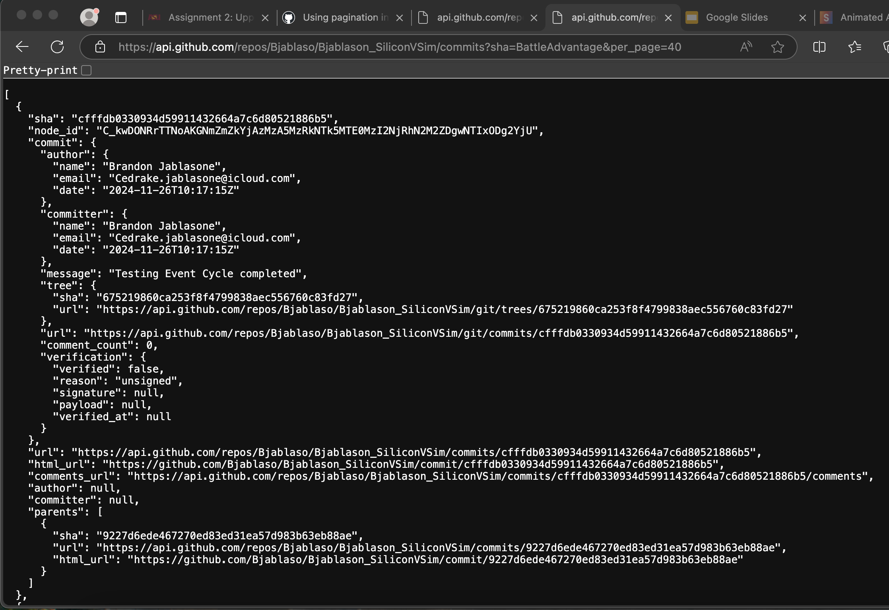
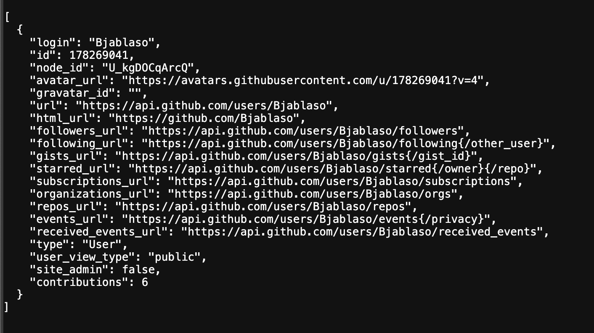
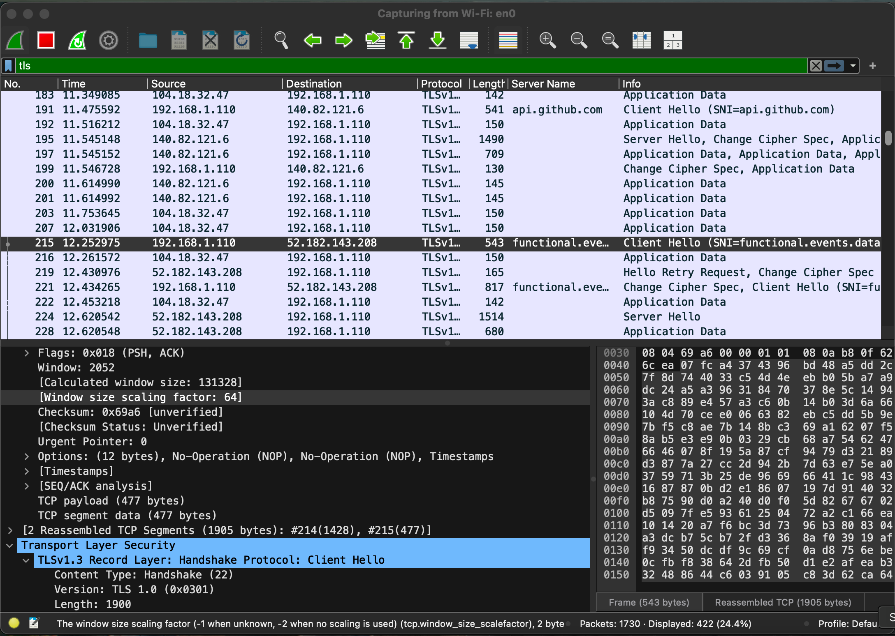
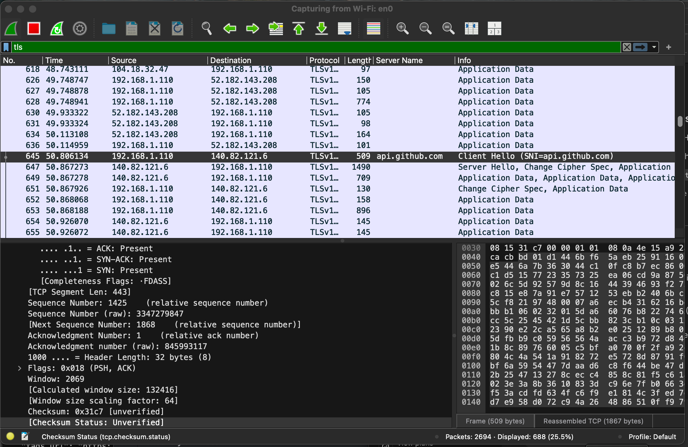
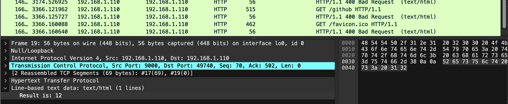
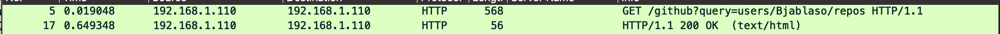
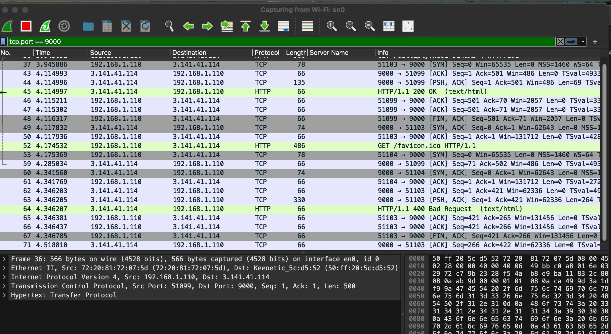

# Assignment 2: Upper Layers of the OSI Model

## Overview
This README documents my findings and results for **Assignment 2: Upper Layers of the OSI Model**. The assignment focuses on understanding HTTP requests, exploring the GitHub API, and observing network traffic through tools like Wireshark.

## Prerequisites
Before starting, ensure the following are completed:
1. **Module 2 readings and videos** on Canvas.
2. Run and understand the following examples from the GitHub repository:
   - `Network/SimpleGrabHttpURL`
   - `Network/SimpleGrabURL`
   - `Network/HTTP-JSON`
3. **Setup a second device** (e.g., a second computer or AWS EC2 instance).
4. Review **Wireshark tutorials**.
5. Understand the **lower layers of the OSI model** (Module 1).

## Learning Objectives
- Understand the purpose and function of upper-layer network protocols.
- Differentiate between HTTP and HTTPS, including message traffic differences.
- Gain familiarity with terminal/command-line tools.

---

## Part 1: Understanding HTTP

### 1.1 List Repositories for a User
**API Call:**
```
https://api.github.com/users/Bjablaso/repos
```

**Description:** 
> This call retrieves all public repositories for the specified GitHub user Bjablaso.

**Deliverable:**
- URL: [List Repositories](https://api.github.com/users/Bjablaso/repos)
- **Screenshot:** [Insert your screenshot here]
> 

---

### 1.2 Get Information About a Specific Repository
**API Call:**
```
https://api.github.com/repos/Bjablaso/Calculator
```

**Description:** 
>This call fetches detailed information about the `Calculator` repository owned by the user `Bjablaso`.

**Deliverable:**
- URL: [Repository Information](https://api.github.com/repos/Bjablaso/Calculator)
- **Screenshot:** [Insert your screenshot here]
> 
---

### 1.3 List All Commits in a Repository
**API Call:**
```
https://api.github.com/repos/Bjablaso/Calculator/commits
```

**Description:** 
>This call retrieves all commits on the default branch of the `Bjablaso` repository.

**Deliverable:**
- URL: [List Commits](https://api.github.com/repos/Bjablaso/Calculator/commits)
- **Screenshot:** [Insert your screenshot here]

---

### 1.4 Specify a Branch and Page Limit
**API Call:**
```
https://api.github.com/repos/Bjablaso/Bjablason_SiliconVSim/commits?sha=BattleAdvantage&per_page=40
```

**Description:** 
>This call retrieves up to 40 commits on a specified branch (`BattleAdvantage`) of the `Bjablason_SiliconVSim` repository.

**Deliverable:**
- URL: [Branch Commits](https://api.github.com/repos/Bjablaso/Bjablason_SiliconVSim/commits?sha=BattleAdvantage&per_page=40)
- **Screenshot:** [Insert your screenshot here]

---

### 1.5 Additional API Call with Query Parameters
**API Call:**
```
https://api.github.com/repos/Bjablaso/Bjablason_SiliconVSim/contributors
```

**Description:** 
> This call lists all contributors for the `Bjablaso` repository.

**Deliverable:**
- URL: [List Contributors](https://api.github.com/repos/Bjablaso/Bjablason_SiliconVSim/contributors)
- **Screenshot:** [Insert your screenshot here]

---

## Part 2: Explanation Questions

### 2.1 Explanation of API Calls
- **List Repositories:** Retrieves all public repositories for a user. [Documentation](https://docs.github.com/en/rest/repos/repos#list-repositories-for-a-user)
- **Repository Information:** Fetches details of a specific repository. [Documentation](https://docs.github.com/en/rest/repos/repos#get-a-repository)
- **List Commits:** Lists commits on the default branch of a repository. [Documentation](https://docs.github.com/en/rest/commits/commits#list-commits)
- **Branch Commits with Pagination:** Retrieves commits on a specified branch with a page limit. [Documentation](https://docs.github.com/en/rest/commits/commits#list-commits)
- **List Contributors:** Lists all contributors to a repository. [Documentation](https://docs.github.com/en/rest/repos/repos#list-repository-contributors)

---

### 2.2 Stateless vs. Stateful Communication
- **Stateless Communication:**
  - Each request is independent, with no memory of previous interactions.
  - Example: HTTP. Each API call provides all necessary data (e.g., authentication, query parameters).

- **Stateful Communication:**
  - The server retains information about client interactions to process subsequent requests.
  - Example: Online banking systems that maintain user sessions.

**Findings:**
- HTTP traffic consists of clear-text messages, including headers and payload.
- Each API call corresponds to a new HTTP GET request, reflecting stateless behavior.
> 
> 
> 
---

## Part 3: Observing Traffic with Wireshark
**Steps Taken:**
1. Opened Wireshark and started capturing network traffic.
2. Performed API calls in the browser while capturing HTTP traffic.
3. Filtered traffic using `http` to isolate relevant packets.
4. Observed HTTP GET request headers and response details.


1. **Browser Screenshot:**
    - Show the browser with the URL `http://<publicIP>:9000` and the loaded web page.
    - 

2. **AWS Machine Screenshot:**
    - Show the terminal on your AWS machine with the server running.
    - 


3. **Analyze What Happen (10point):**

**Findings:**
**1. What filter did you use? Explain why you chose that filter.**
> **Filter:** `http && tcp.port == 9000`
> This filter limit HTTP Traffic to Port `9000`. We should support being used by my web server on AWS.


**2. What happens when you are on the /random page and click the "Random" button? Compare this to refreshing your browser.**
> Clicking on the "Random Button" on the "Random page" generate a random image which is directly fetch and loaded   `/json`.
> Refreshing the page does the same thing as clicking the button on the page 


**3. What types of response codes are you able to receive through different requests to your server?**
> **200 OK:** Returned for valid requests (e.g., `/random`, `/json`).
> **400 Bad Request:** When an invalid or malformed request is sent.
> **404 Not Found:** Returned when requesting a non-existent resource.

**4. Explain the response codes you receive and why you get them.**
> i receive a response code of **200 OK:** The request was successful, and the server returned the requested content.
> 

**5. When you do a <publicIPOfYourSecondMachine>:9000, take a look at what Wireshark generates as a server response. Are you able to find the data that the server sends back to you?**
> Because I am using HTTP instead of HTTP(S), I am able to see the server response data visibly and "Data" section of WireShark. The data is shown as plain text. 

**6. Based on the previous question, explain why HTTPS is now more common than HTTP.**
>HTTPS encrypts the data, ensuring confidentiality and security for transmitted information. HTTP sends data in plain text, which can be intercepted.

**7 In our case - what port does the server listen to for HTTP requests, and is that the most common port for HTTP?**
> And this example, we have the server listen it on port `9000`. However, HTTP commonly listen on port `80`. 

**8. Which local port is used when sending different requests to the WebServer?**
> The local port use when sending HTTP/HTTP(S) request to a WebServer is `13119` or `4500`


