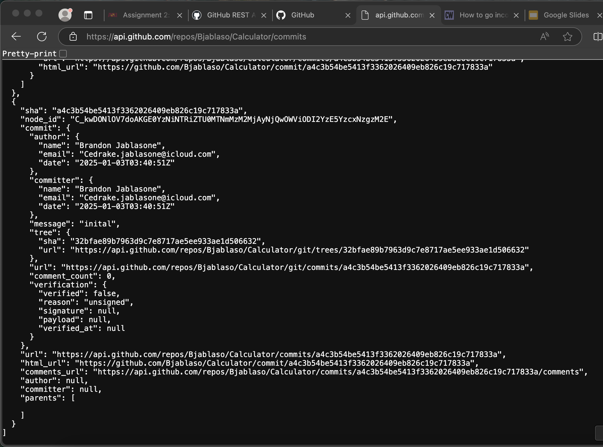

# **Assignment 2: Upper Layers of the OSI Model**

## Overview
This README documents my findings and results for **Assignment 2: Upper Layers of the OSI Model**. The assignment focuses on understanding HTTP requests, exploring the GitHub API, and observing network traffic through tools like Wireshark.


## Prerequisites
Before starting, ensure the following are completed:
1. **Module 2 readings and videos** on Canvas.
2. Run and understand the following examples from the GitHub repository:
   - `Network/SimpleGrabHttpURL`
   - `Network/SimpleGrabURL`
   - `Network/HTTP-JSON`
3. **Setup a second device** (e.g., a second computer or AWS EC2 instance).
4. Review **Wireshark tutorials**.
5. Understand the **lower layers of the OSI model** (Module 1).

## Learning Objectives
- Understand the purpose and function of upper-layer network protocols.
- Differentiate between HTTP and HTTPS, including message traffic differences.
- Gain familiarity with terminal/command-line tools.

---

## Part 1: Understanding HTTP

### 1.1 List Repositories for a User
**API Call:**
```
https://api.github.com/users/Bjablaso/repos
```

**Description:** 
> This call retrieves all public repositories for the specified GitHub user Bjablaso.

**Deliverable:**
- URL: [List Repositories](https://api.github.com/users/Bjablaso/repos)
- **Screenshot:** [Insert your screenshot here]
> 

---

### 1.2 Get Information About a Specific Repository
**API Call:**
```
https://api.github.com/repos/Bjablaso/Calculator
```

**Description:** 
>This call fetches detailed information about the `Calculator` repository owned by the user `Bjablaso`.

**Deliverable:**
- URL: [Repository Information](https://api.github.com/repos/Bjablaso/Calculator)
- **Screenshot:** [Insert your screenshot here]
> 
---

### 1.3 List All Commits in a Repository
**API Call:**
```
https://api.github.com/repos/Bjablaso/Calculator/commits
```

**Description:** 
>This call retrieves all commits on the default branch of the `Bjablaso` repository.

**Deliverable:**
- URL: [List Commits](https://api.github.com/repos/Bjablaso/Calculator/commits)
- **Screenshot:** [Insert your screenshot here]
> 
---

### 1.4 Specify a Branch and Page Limit
**API Call:**
```
https://api.github.com/repos/Bjablaso/Bjablason_SiliconVSim/commits?sha=BattleAdvantage&per_page=40
```

**Description:** 
>This call retrieves up to 40 commits on a specified branch (`BattleAdvantage`) of the `Bjablason_SiliconVSim` repository.

**Deliverable:**
- URL: [Branch Commits](https://api.github.com/repos/Bjablaso/Bjablason_SiliconVSim/commits?sha=BattleAdvantage&per_page=40)
- **Screenshot:** [Insert your screenshot here]
> 
---

### 1.5 Additional API Call with Query Parameters
**API Call:**
```
https://api.github.com/repos/Bjablaso/Bjablason_SiliconVSim/contributors
```

**Description:** 
> This call lists all contributors for the `Bjablaso` repository.

**Deliverable:**
- URL: [List Contributors](https://api.github.com/repos/Bjablaso/Bjablason_SiliconVSim/contributors)
- **Screenshot:** [Insert your screenshot here]
> 
---

## Part 2: Explanation Questions

### 2.1 Explanation of API Calls
- **List Repositories:** Retrieves all public repositories for a user. [Documentation](https://docs.github.com/en/rest/repos/repos#list-repositories-for-a-user)
- **Repository Information:** Fetches details of a specific repository. [Documentation](https://docs.github.com/en/rest/repos/repos#get-a-repository)
- **List Commits:** Lists commits on the default branch of a repository. [Documentation](https://docs.github.com/en/rest/commits/commits#list-commits)
- **Branch Commits with Pagination:** Retrieves commits on a specified branch with a page limit. [Documentation](https://docs.github.com/en/rest/commits/commits#list-commits)
- **List Contributors:** Lists all contributors to a repository. [Documentation](https://docs.github.com/en/rest/repos/repos#list-repository-contributors)

---

### 2.2 Stateless vs. Stateful Communication
- **Stateless Communication:**
  - Each request is independent, with no memory of previous interactions.
  - Example: HTTP. Each API call provides all necessary data (e.g., authentication, query parameters).

- **Stateful Communication:**
  - The server retains information about client interactions to process subsequent requests.
  - Example: Online banking systems that maintain user sessions.

**Findings:**
- HTTP traffic consists of clear-text messages, including headers and payload.
- Each API call corresponds to a new HTTP GET request, reflecting stateless behavior.
> 
> 
> 
---

## Part 3: Observing Traffic with Wireshark
**Steps Taken:**
1. Opened Wireshark and started capturing network traffic.
2. Performed API calls in the browser while capturing HTTP traffic.
3. Filtered traffic using `http` to isolate relevant packets.
4. Observed HTTP GET request headers and response details.


1. **Browser Screenshot:**
    - Show the browser with the URL `http://<publicIP>:9000` and the loaded web page.
    - 

2. **AWS Machine Screenshot:**
    - Show the terminal on your AWS machine with the server running.
    - 


3. **Analyze What Happen (10point):**

**Findings:**
**1. What filter did you use? Explain why you chose that filter.**
> **Filter:** `http && tcp.port == 9000`
> This filter limit HTTP Traffic to Port `9000`. We should support being used by my web server on AWS.


**2. What happens when you are on the /random page and click the "Random" button? Compare this to refreshing your browser.**
> Clicking on the "Random Button" on the "Random page" generate a random image which is directly fetch and loaded   `/json`.
> Refreshing the page does the same thing as clicking the button on the page 


**3. What types of response codes are you able to receive through different requests to your server?**
> **200 OK:** Returned for valid requests (e.g., `/random`, `/json`).
> **400 Bad Request:** When an invalid or malformed request is sent.
> **404 Not Found:** Returned when requesting a non-existent resource.

**4. Explain the response codes you receive and why you get them.**
> i receive a response code of **200 OK:** The request was successful, and the server returned the requested content.
> 

**5. When you do a <publicIPOfYourSecondMachine>:9000, take a look at what Wireshark generates as a server response. Are you able to find the data that the server sends back to you?**
> Because I am using HTTP instead of HTTP(S), I am able to see the server response data visibly and "Data" section of WireShark. The data is shown as plain text. 

**6. Based on the previous question, explain why HTTPS is now more common than HTTP.**
>HTTPS encrypts the data, ensuring confidentiality and security for transmitted information. HTTP sends data in plain text, which can be intercepted.

**7 In our case - what port does the server listen to for HTTP requests, and is that the most common port for HTTP?**
> And this example, we have the server listen it on port `9000`. However, HTTP commonly listen on port `80`. 

**8. Which local port is used when sending different requests to the WebServer?**
> The local port use when sending HTTP/HTTP(S) request to a WebServer is `13119` or `4500`


## Part 4: Setting Up a "Real" Web Server
1. **Install Nginx on the Second Machine:**
   ```bash -> using mac
   brew install nginx
   sudo  nginx 
   ```

2. **Modify the Nginx Configuration:**
    - Open the Nginx configuration file:
      ```bash
         sudo nano /opt/homebrew/etc/nginx/nginx.conf

      ```
    - Update the `server` block to forward traffic from port `80` to your Java web server:
      ```nginx
        server {
            listen       80;
          server_name  localhost;

             #charset koi8-r;

            #access_log  logs/host.access.log  main;
    
              location / {
                 proxy_pass http://51.20.144.68:9000;
              }
    
              #error_page  404              /404.html;

              # redirect server error pages to the static page /50x.html
              #error_page   500 502 503 504  /50x.html;
      
              location = /50x.html {
                 root   html;
              }

      ```
    - Save and exit the file.

3. **Restart Nginx to Apply Changes:**
   ```bash
   sudo service nginx restart
   ```

### 5.2 Testing the Nginx Setup

1. **Start the Java Web Server:**
   ```bash
   cd ~/Assignment2/WebServer
   gradle FunWebServer
   ```

2. **Access the New URL:**
    - Open a browser and access the main page using the new URL:
      ```
      http://<publicIPOfYourSecondMachine>
      ```

3. **Monitor Traffic Using Wireshark:**
    - Apply the filter:
      ```
      http && tcp.port == 80
      ```
    - This will capture HTTP traffic routed through port `80`.

**1. What is the URL that you can now use to reach the main page?**
>The new URL is `http://localhost` (or `http://192.168.1.1` if accessed remotely).

**2. Check the traffic to your WebServer. What port is the traffic going to now? Is it the same as before, or is it (and should it) be different?**
> Traffic now flow through port `80`. It was flowing through  `9000`. Port `80` is the standard port for HTTP traffic.

**3. Is it still using HTTP, or is it now using HTTPS? Why?**
>We are using HTTP because SSL/TLS is not configure for HTTPS. Configuring HTTPS would require additional steps, such as installing a certificate.

**4. Could you change your security settings on AWS now?**
> Yes, port `9000` can be removed from the AWS security group since traffic is now routed through Nginx on port `80`.

**5. Take a screenshot of your web browser, your second machine, and the port number on Wireshark.**
- Include a screenshot showing:
   1. The browser with the new URL (`http://<publicIPOfYourSecondMachine>`) and the loaded page.
 > 
   2. The terminal on the AWS machine showing both Nginx and the Java web server running.
> 
   3. Wireshark showing traffic captured on port `80`.
> 


### Assignment 2: Programming Your WebServer (35 points)

#### **2.6.1 Multiply (5 points)**

##### Task:
Implement error handling for the `multiply` case to ensure the server does not crash when incorrect inputs are provided. Provide an appropriate HTTP response code and message.

###### Implementation Plan:
1. Check if the required `num1` and `num2` parameters are provided in the query string.
2. If any parameter is missing or invalid:
    - Return a `400 Bad Request` error if the input is malformed.
    - Return a `406 Not Acceptable` error if the values are invalid and cannot be processed.
3. Provide meaningful error messages in the response.

###### Result 
-  URL with correct input: `http://192.168.1.110:9000/multiply?num1=3&num2=4`

- 
> Response: `Result is: 12`

- with missing input: `http://192.168.1.110:9000/multiply?num1=3`
- 
- 
> Response: `400 Bad Request -  Missing required parameters 'num1' and/or 'num2'.`

- URL with correct input: `http://192.168.1.110:9000/multiply?num1=abc&num2=6`
- 
> Response: `406 Not Acceptable - Parameters 'num1' and 'num2' must be integers.`


#### **2.6.2 GitHub (9 points)**

##### Task:
Implement the `github?` request to fetch and parse data from the GitHub API. The response should include the `full_name`, `ID`, and `login` of the owner for each repository.

###### Implementation Plan:
1. Parse the `query` parameter from the request.
2. Fetch the JSON response from the GitHub API.
3. Parse the JSON to extract:
    - `full_name`
    - `ID`
    - `login` of the owner.
4. Return the parsed data in a simple HTML format.
5. Add error handling for:
    - Missing or invalid `query` parameter (`400 Bad Request`).
    - Failed API fetch (`502 Bad Gateway`).

###### Results:
- URL: `http://192.168.1.110:9000/github?query=users/Bjablaso/repos`
- 
- 
> Response:
      ```html
      <ul>
        <li>Repo: Calculator, ID: 890950476, Owner: Bjablaso</li>
        <li>Repo: Connect4, ID: 890950476, Owner: Bjablaso</li>
      </ul>
      ```
- URL with missing query: `http://localhost:9000/github`
> Response: `400 Bad Request - I am not sure what you want me to do...`

> 
> 
- URL with invalid API response:
> Response: `502 Bad Gateway - Unable to fetch data from GitHub API.`


#### **2.6.3 Custom Requests (14 points)**

##### Task:
Add two new request types to the WebServer, fulfilling the following requirements:
1. Provide functionality beyond simple arithmetic.
2. Accept at least two arguments and use them meaningfully.
3. Include proper error handling with appropriate HTTP response codes.
4. Explain the new requests on the main web page with examples.

###### Request 1: Weather Lookup
##### Results :
> **URL:** `http://192.168.1.110:9000/weather?city=Phoenix,NewYork,LosAngeles&unit=metric`
> 
> 
- **Functionality:** Fetch weather data for a given city and display it in the specified unit (metric or imperial).

- **Error Handling:**
    - `400 Bad Request` if required parameters (`city`, `unit`) are missing.
    - `406 Not Acceptable` if the `unit` value is invalid.
    - `502 Bad Gateway` if the external weather API fails.

###### Request 2: Independent Contries
> **URL:** `http://192.168.1.110:9000/countries?name=united&capital=washington`
- 
- 
- **Functionality:** Fetch data about independent countries using the  Countries rest API.
- **Error Handling:**
    - `502` Bad Gateway: If the external  Countries rest API fails or is unreachable.
     - `500` Internal Server Error: If an unexpected error occurs while processing the request.

###### Explanation:
- Both requests enrich the server's functionality by integrating real-world APIs.
- Proper error handling ensures the server is robust against incorrect inputs or external API issues.

---


#### **2.6.4 WebServer for Everyone (5 points)**

##### Task:
Ensure your WebServer continues running even when you close the terminal.

###### Implementation Plan:
1. Use a process manager like `screen` or `tmux`:
    - Start a new session:
      ```bash
      screen -S webserver
      ```
    - Run the server:
      ```bash
      gradle FunWebServer
      ```
    - Detach the session by pressing `CTRL+A`, then `D`.
> 
> server should be running 

###### Access my Server:
- Access your server using:
  ```
  http://51.20.144.68:9000
  ```


#### **2.6.5 Test Other WebServers (2 points)**

##### Task:
Test two other servers posted in the #servers Slack channel and provide valuable comments.

###### Steps:
1. Visit the URLs shared by your peers in the #servers Slack channel.
2. Test their functionality by performing requests or navigating the server.
3. Provide meaningful feedback:
    - Highlight what works well.
    - Suggest improvements (if any).

###### Result :
- **Server URL:** `http://3.141.41.114:9000/` from `Samuel Arndt`
- **Feedback:** The server's `/random` return random image, I test out multiple functionality and the
- server seems to work just fine. 

- 
---
###### Linl -> 

- **Git Hub** :  [Bjablaso](https://github.com/Bjablaso/ser321-spring25-A-Bjablaso/tree/main/Assignment2)
                [Bjablaso-Assignment2](https://github.com/Bjablaso/ser321-spring25-A-Bjablaso/tree/main/Assignment2)
> In case the link above don't work :  https://github.com/Bjablaso/ser321-spring25-A-Bjablaso/tree/main/Assignment2


