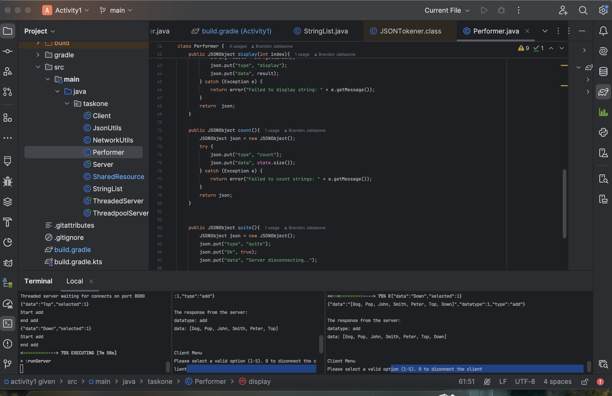

# Assignment 4 Activity 1
## Description
The initial Performer code only has one function for adding strings to an array.

The Operations to Implement:
- Add: Adds a new string to the list of strings.
- Display: Displays the string at the specified index in the list.
- Count: Returns the number of strings in the list.

## Protocol

### Requests
General Request Format:
```
{ 
   "selected": <int: 1=add, 3=display, 4=count,  0=quit>, 
   "data": <thing to send>
}
```
Fields:
 - selected <int>: The operation selected.
 - data <Depends on the operation>:
   - add <String>: The string to be added.
   - display <None>: Display List
   - count <None>: None.
   - quit <None>: None.

### Responses
General Success Response: 
```
{
   "type": <String: "add", "display", "count", "quit">, 
   "data": <thing to return> 
}
```

Fields:
 - type <String>: Echoes original operation selected from request.
 - data <Depends on the operation>: The result returned by the server.
   - Add <String>: Returns the new list 
   - Display <String>: String from list at specified index
   - Count <int>: Number of elements (Strings) in the list
 
General Error Response: 
```
{
   "type": "error", 
   "message"": <error string> 
}
```

## How to run the program
### Terminal
Base Code, please use the following commands:
```
    For Server, run "gradle runServer -Pport=9099 -q --console=plain"
```
```   
    For Client, run "gradle runClient -Phost=localhost -Pport=9099 -q --console=plain"
```   


##### ThreadedServer 

I implemented the threaded server example handing multiple thread and updateting a share resoure 
